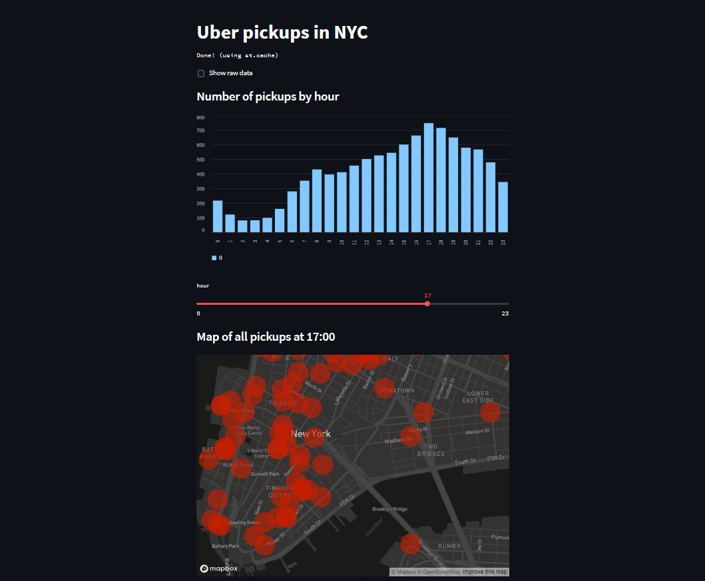
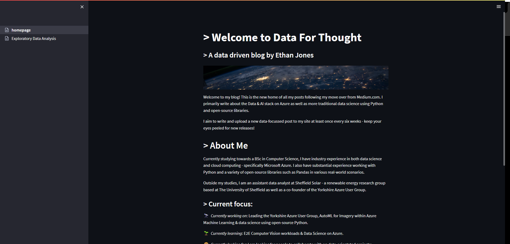

# Example Streamlit applications

A few examples from my learning journey with Streamlit.io

* [Single-page visualisation of NYC Uber data](./example_app/example.py)

* [Multi-page concept of a blog](./blog_app)

## References / resources

* [API reference](https://docs.streamlit.io/library/api-reference)
* [Streamlit examples](https://streamlit.io/gallery)
